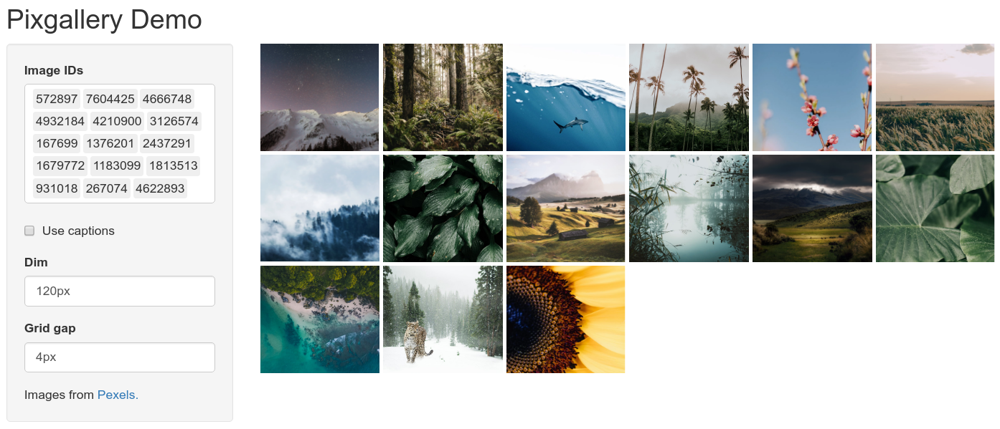

```{r setup, include=FALSE}
knitr::opts_chunk$set(echo = TRUE)
```

This is a demo of the function `pixfigure()`. This is useful for individual images or a set of images but not in a gallery format. The mandatory input required is one or more paths/URLs to image(s).

```{r}
library(pixture)
paths <- c(
"https://images.pexels.com/photos/572897/pexels-photo-572897.jpeg?auto=compress&cs=tinysrgb&dpr=2&h=650&w=940",
"https://images.pexels.com/photos/7604425/pexels-photo-7604425.jpeg?auto=compress&cs=tinysrgb&dpr=2&h=650&w=940",
"https://images.pexels.com/photos/4666748/pexels-photo-4666748.jpeg?auto=compress&cs=tinysrgb&dpr=2&h=650&w=940")
```

Clicking on the thumbnail opens up the full image in a lightbox.

```{r}
pixfigure(paths[1])
```

# Caption

Optionally, captions can be added to the images which are displayed below the images as well as in the lightbox.

```{r}
pixfigure(paths[1], caption="Night sky over the mountains")
```

# Dimensions

The argument `h` and `w` is used to adjust the dimension of the image. This value is a string in any valid css unit.

```{r}
pixfigure(paths[1], w="400px")
```

```{r}
pixfigure(paths[3], h="400px", caption="shark")
```

# Fit

The argument `fit` is used to control css property [`object-fit`](https://developer.mozilla.org/en-US/docs/Web/CSS/object-fit). It is set to `cover` by default.

```{r}
pixfigure(paths[1], h="600px")
```

Resize the width of the page to see the effect of `fit="cover"`. The image scales within it's frame rather than shrink. Explore css property **object-fit** for more details, for example, on [w3schools](https://www.w3schools.com/css/css3_object-fit.asp).

# Position

The argument `position` determines how the image is positioned within the frame. This controls css property [`object-position`](https://developer.mozilla.org/en-US/docs/Web/CSS/object-position).

```{r}
pixfigure(paths[1], h="400px", w="400px", position="left")
```

```{r}
pixfigure(paths[1], h="400px", w="400px", position="right")
```

Here is a [youtube video](https://www.youtube.com/watch?v=6yAAV-uP0po) that discusses fit and position.

# Multiple images

Input can also be a vector images. Images are displayed one after the other.

```{r}
pixfigure(paths, caption=c("Night sky over the mountains", "Walking through dense woodland", "Out in the open seas"), h="200px", w="250px", position="left")
```

# Local images

Local images (not on the internet) can be provided as relative or absolute paths. The images do not show up in the RStudio notebook preview, but they should work in a rendered document.

```{r}
pixfigure("images/pexels-photo-3126574.jpg", h="300px")
```

Here is another example using sample images from the package. Note that this only works locally.

```{r}
paths <- list.files(system.file("extdata/images", package="pixture"), full=TRUE)
paths
pixfigure(paths[1])
```

# Shiny app

This is an example of a shiny app using `pixfigure()`.



To try out a demo app, run `pixture::runPixfigure()`. Use shiny helper functions `pixfigureOutput()` and `renderPixfigure()`. The shiny code is given below:

```{r,eval=FALSE}
path <- "https://images.pexels.com/photos/4932184/pexels-photo-4932184.jpeg?auto=compress&cs=tinysrgb&dpr=2&h=650&w=940;https://images.pexels.com/photos/572897/pexels-photo-572897.jpeg?auto=compress&cs=tinysrgb&dpr=2&h=650&w=940;https://images.pexels.com/photos/7604425/pexels-photo-7604425.jpeg?auto=compress&cs=tinysrgb&dpr=2&h=650&w=940"
captions <- "Palm trees;Night sky;Woodland"

ui <- fluidPage(
    titlePanel("Pixfigure Demo"),
    sidebarLayout(
        sidebarPanel(width=3,
            textAreaInput("path", "Image URLs", value=path, height="200px"),
            checkboxInput("caption_check", "Use captions", value=FALSE),
            uiOutput("caption_ui"),
            textInput("height", label = "Height", value="auto"),
            textInput("width", label = "Width", value="100%"),
            textInput("fit", label = "Object fit", value="cover"),
            textInput("position", label = "Object position", value="center"),
            HTML("Image from <a href='https://www.pexels.com/'>Pexels.</a>")
        ),
        mainPanel(width=9,
            pixture::pixfigureOutput("fig")
        )
    )
)

server <- function(input, output) {
    output$caption_ui <- renderUI({
        if(input$caption_check) {
            textInput("caption", "Caption", value=captions)
        }
    })

    output$fig <- pixture::renderPixfigure({
      
      if(!is.null(input$path)) path <- unlist(strsplit(input$path, ";"))

      if(input$caption_check){
        if(!is.null(input$caption)){
          cpt <- unlist(strsplit(input$caption, ";"))
          if(length(cpt)!=length(path)) stop("Number of captions do not match number of images.")
          pixture::pixfigure(path, caption=cpt, h = input$height, w = input$width, fit = input$fit, position = input$position)
        }
      }else{
          pixture::pixfigure(path, h = input$height, w = input$width, fit = input$fit, position = input$position)
      }
    })
}

shinyApp(ui = ui, server = server)
```

To use local images in Shiny, the images can be added to the `www` directory and the paths are relative. For example; an image at `app/www/images/image.jpg` is referenced in the app as `images/image.jpg`.

